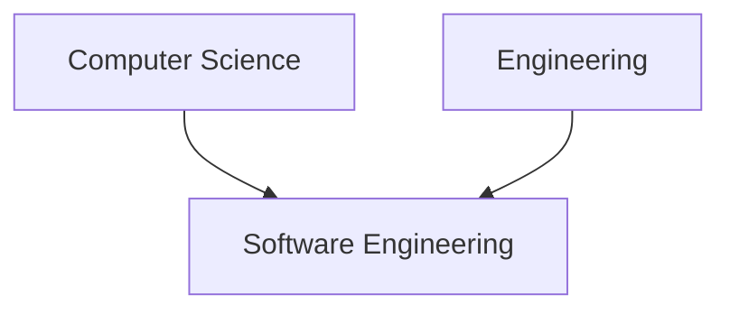

# Design Patterns

SOLID Principles and the Art of Design Patterns

---
layout: center
transition: fade
---

# What are we?


---


---
layout: center
transition: fade
---

# I was joking xD

---
layout: center
transition: fade
---

# We are Software <span v-mark="{ at: 1, color: '#005c5c', type: 'highlight' }">Engineers</span>

---
layout: center
transaction: fade
---

> <span v-mark="{ at: 1, color: '#474a00', type: 'box' }">Engineering</span> is the practice of using <span v-mark="{ at: 2, color: '#004647', type: 'highlight' }">natural science</span>, <span v-mark="{ at: 2, color: '#004647', type: 'highlight' }"> mathematics</span>, and the <span v-mark="{ at: 2, color: '#004647', type: 'highlight' }">engineering design process</span> to solve technical problems, increase efficiency and productivity, and improve systems.

Source: Wikipedia


---
layout: center
transaction: fade
---


---
layout: center
---

# Top Microsoft Projects

| Repository | Owner     | Stars | Contributors | Commits |
|------------|-----------|-------|--------------|---------|
| TypeScript | Microsoft | 101k  | 789          | 36k     |
| VSCode     | Microsoft | 164k  | 2107         | 127k    |

---

# Semantic Versioning 2.0.0

<div style="text-align: center; margin-bottom: 2rem;">
  <h1 style="font-size: 4rem; color: #005c5c">X.Y.Z</h1>
</div>

<v-clicks>

- Major (X): incompatible API changes
- Minor (Y): add functionality in a backward compatible manner
- Patch (Z): make backward compatible bug fixes

</v-clicks>

---

# Major Update (X)

> Old version uses the naive algorithm.

```python {*}{lines:true}
class Math:
    def add_matrix(matA, matB):
        matR = []
        for i in range(len(matA)):
            matR.append([])
            for j in range(len(matA[0])):
                matR[-1].append(matA[i][j] + matB[i][j])
        return matR
```

> New version uses `numpy` for adding two matrices.

```python {*}{lines:true}
import numpy as np

class Math:
    def add_matrix(ndA, ndB):
        return np.add(ndA, ndB)
```

<v-clicks>

- Wherever this function is used, it must be refactored.
- That is why it is a <span v-mark="{ at: 3, color: '#590000', type: 'highlight' }">breaking change</span>

</v-clicks>

---

# Minor Update (Y)

> No changes on old functions

```python {*}{lines:true}
class Math:
    def add_matrix(ndA, ndB):
        return np.add(ndA, ndB)
```

> New version comes with a brand new function.

```python {5,6}{lines:true}
class Math:
    def add_matrix(ndA, ndB):
        return np.add(ndA, ndB)
    
    def dot_matrix(ndA, ndB):
        return np.dot(ndA, ndB)
```

<v-clicks>

- Whoever wants to can use this new method.

</v-clicks>

---

# Patch/Bugfix Update (Z)

> Consider a tiny assertion.

```python {*}{lines:true}
class Math:
    def add_matrix(ndA, ndB):
        return np.add(ndA, ndB)
    
    def dot_matrix(ndA, ndB):
        return np.dot(ndA, ndB)
```

> Assertion will check if inputs are in the same shape.

```python {3,7}{lines:true}
class Math:
    def add_matrix(ndA, ndB):
        assert ndA.shape == ndB.shape
        return np.add(ndA, ndB)
    
    def dot_matrix(ndA, ndB):
        assert ndA.shape == ndB.shape
        return np.dot(ndA, ndB)
```

<v-clicks>

- Usually bug fixed are distributed over all minor version. (5.7.<span v-mark="{ at: 3, color: '#005904', type: 'highlight' }">3</span> and 5.4.<span v-mark="{ at: 3, color: '#005904', type: 'highlight' }">3</span> at the same time)

</v-clicks>

---
layout: center
---

# SOLID

---

# <span v-mark="{ at: 1, color: '#474a00', type: 'box' }">S</span>OLID
## Problem 

```python {*}{lines:true}
class OrderService:
    def process_order(self, order):
        pass

    def send_order_email(self, order):
        pass
```

<v-clicks>

- How should we write tests for this class?
- Does this class stands on its own?
- What if we want to use the `OrderService` somewhere without needing the email functionality?

</v-clicks>

---


---

# <span v-mark="{ at: 0, color: '#474a00', type: 'box', animate: false }">S</span>OLID
## Solution

````md magic-move {lines:true}
```python
class OrderService:
    def process_order(self, order):
        pass

    def send_order_email(self, receiver, order):
        pass
```

```python
class OrderService:
    def __init__(self):
        self.email_service = EmailService()

    def process_order(self, order):
        pass


class EmailService:
    def send_email(self, receiver, order):
        pass
```
````

---

# S<span v-mark="{ at: 1, color: '#474a00', type: 'box' }">O</span>LID
## Problem 

```python {*}{lines:true}
import email_library #v3.2.5

class EmailService:
    def send_email(self, receiver, order):
        email_library.send(
            receiver,
            'Order Processed',
        )
```

<v-clicks>

- The package released a breaking change.
- Where is this package used in the source code?

</v-clicks>

---


---

# S<span v-mark="{ at: 0, color: '#474a00', type: 'box', animate: false }">O</span>LID
## Solution

````md magic-move {lines:true}
```python {*}
import email_library #v3.2.5

class EmailService:
    def send_email(self, receiver, order):
        email_library.send(
            receiver,
            'Order Processed',
        )
```

```python {3,4|7-15|12}
import email_library #v3.2.5

class EmailProxy:
    def send(email, text):
        pass


class EmailService:
    def __init__(self):
        self.email_proxy = EmailProxy()

    def send_order_email(self, order):
        self.email_proxy.send(
            order.customer.email,
            'Order Processed',
        )
```
````

<v-clicks>

- This is <span v-mark="{ at: 5, color: '#005904', type: 'highlight' }">Proxy Pattern</span> 

</v-clicks>

---

# SO<span v-mark="{ at: 1, color: '#474a00', type: 'box' }">L</span>ID
## Problem

```python {*|13}{lines:true}
class Member:
    def calculate_shipping_fee(self):
        return 0.1


class PremiumMember(Member): # Inherit from Member
    pass


class OrderService:
    def checkout(order, member):
        ...
        fee = member.calculate_shipping_fee()
        ...

```

<v-clicks>

- What if an instance of `PremiumMember` is passed to the checkout method?

</v-clicks>

---


---

# SO<span v-mark="{ at: 0, color: '#474a00', type: 'box', animate: false }">L</span>ID
## Solution


````md magic-move
```python {*}{lines:true}
class Member:
    def calculate_shipping_fee(self):
        return 0.1


class PremiumMember(Member): # Inherit from Member
    pass


class OrderService:
    def checkout(order, member):
        ...
        fee = member.calculate_shipping_fee()
        ...

```

```python {*}{lines:true}
class Member:
    def calculate_shipping_fee(self):
        return 0.1


class PremiumMember(Member): # Inherit from Member
    def calculate_shipping_fee(self):
        return 0


class OrderService:
    def checkout(order, member):
        ...
        fee = member.calculate_shipping_fee()
        ...
```
````

---

# SOL<span v-mark="{ at: 1, color: '#474a00', type: 'box' }">I</span>D
## Problem

````md magic-move
```python {*}{lines:true}
class UserActions:
    def place_order(self): ...
    def cancel_order(self): ...
    def track_order(self): ...
    def manage_inventory(self): ... # Only for admins
```

```python {*}{lines:true}
class UserActions:
    def place_order(self): ...
    def cancel_order(self): ...
    def track_order(self): ...
    def manage_inventory(self): ... # Only for admins

class Customer(UserAction):
    def place_order(self): ...
    def cancel_order(self): ...
    def track_order(self): ...
    def manage_inventory(self): ... # Forced to implement
```
````

<v-clicks>

- Clients should not be forced to depend on interfaces they do not use.

</v-clicks>

---

# SOL<span v-mark="{ at: 0, color: '#474a00', type: 'box', animate: false }">I</span>D
## Solution


---

# SOLI<span v-mark="{ at: 1, color: '#474a00', type: 'box' }">D</span>
## Problem

---

# SOLI<span v-mark="{ at: 0, color: '#474a00', type: 'box', animate: false }">D</span>
## Solution

---
layout: center
---

# Design Patterns

---


---
layout: center
---

# Real Life Analogies

---
layout: center
---

# Item Search

---
layout: center
---

# Email Library

---
layout: center
---

# Graphic Libraries

---
layout: center
---

# Tehran Stocks Market

---
layout: center
---

# Financial Report

---

# Was google ever down?


---

# Microservices

<v-clicks>

- Separation of Concerns
- DRY
- KISS

</v-clicks>

---

# Why should I learn patterns?

<v-clicks>

- They are tried and tested

- Solutions to common problems

- Problem solving skill

- Common language <span v-mark>in professional teams</span>


</v-clicks>

<span v-click>Source: refactoring.guru</span>

---
layout: center
---

# Thanks
made with <3 by AlirezaOpmc